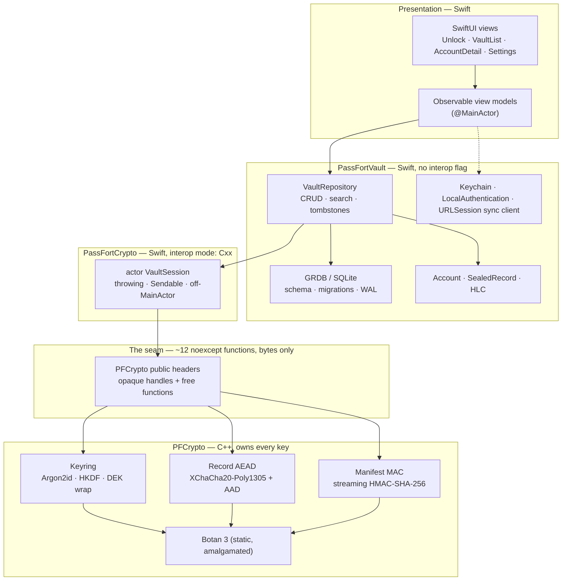
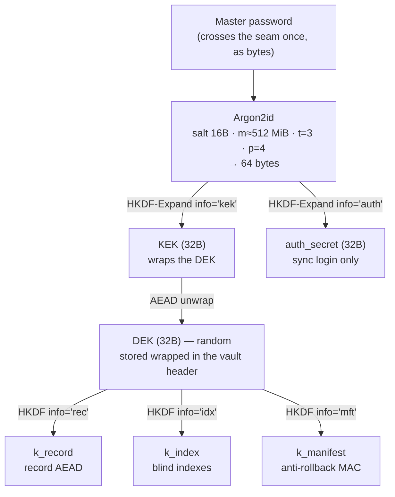
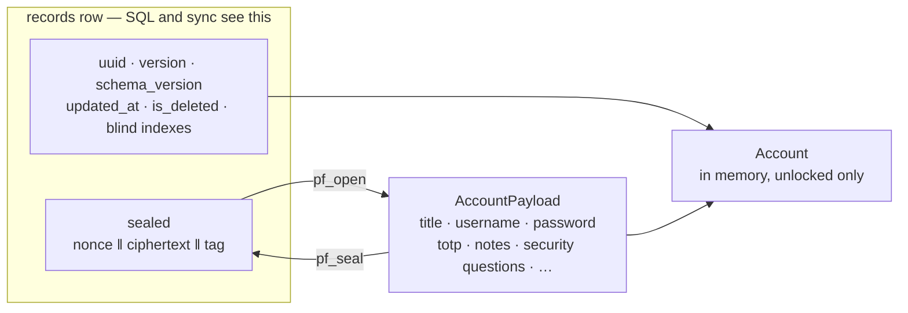

# PassFort — Architecture

**Status:** Draft (scaffolding). Nothing is built yet; this document is the plan we design against.
**Last updated:** 2026-09-02 (rev 8 — `AccountPayload` gains `revisionHistory` and `passwordHistory` / `passwordChangedAt` are now written by `VaultRepository` on every edit (§7.2, §7.3, §7.7); a new optional payload key, absorbed by the `unknown` forward-compat bag — no ADR, no migration, no schema bump; §4 app-source folder is `PassFort/` not `App/` (Xcode's synchronized-group folder; `.xcodeproj` still at the repo root) and its `Info.plist` is build-generated; rev 7 — recovery-key DEK slot folded into header format v1 per ADR-0007: §5.3 gains `slot_count` + an optional second slot, no version bump, no migration; §5.6 recovery key rendered Crockford Base32; open decisions 5, 6, 7, 11, 17 resolved (JSON payload, GRDB, 256-byte padding, `usedAt` deferred, recovery slot in v1); rev 6 — Botan pin bumped 3.12.0 → 3.13.0 per ADR-0001 amendment; rev 5 — CI and release pipeline added as §13.2–§13.4, §13 retitled "Testing, CI, and release", open decision 16 added; rev 4 — Azure backend §10 and web client §11 folded in per ADR-0005/0006, former §10–§13 renumbered to §12–§15)

---

## 1. What this is

PassFort is a macOS password manager with:

- a **C++ crypto core** that owns key derivation, the key hierarchy, authenticated encryption and the manifest MAC — and nothing else;
- a **Swift layer** that owns storage, the record model, sync and the SwiftUI presentation;
- **direct Swift↔C++ interoperability** across a deliberately tiny, byte-oriented seam — about a dozen functions, no Objective-C++ shim, no C wrapper library;
- **encryption at rest** as a hard requirement from day one, and **encryption in transit** (optional cloud sync) as a later phase;
- an **optional Azure backend** (§10) and a **browser client** (§11) that reuse the same vault format and the same crypto core — the server only ever holds ciphertext, and the web client runs that core compiled to WebAssembly.

### 1.1 Goals

1. A working GUI with CRUD over a database of `Account` records.
2. The local database is unreadable without the master password — including its metadata.
3. Optional sync where the server/cloud provider learns nothing but ciphertext sizes and timestamps.
4. **Learning goal:** understand, and be able to justify in writing, every cryptographic choice in §5 and §9. The ADRs in `docs/adr/` exist for that.
5. **Learning goal:** exercise Swift↔C++ interop on a seam small enough to get right and real enough to be worth doing.
6. **Learning goal:** stand up a minimal, cheap Azure backend — Functions + Table Storage + Static Web Apps, provisioned as code — that holds only ciphertext and costs approximately nothing at rest (§10).
7. **Learning goal:** run the *same* crypto core in a browser via WebAssembly, and be able to explain exactly what end-to-end encryption in a web app does and does not buy you (§11, ADR-0006).

### 1.2 Non-goals (for now)

- iOS/iPadOS targets. The crypto core is portable; the app is macOS-first. Don't pay for a shared UI layer before there's a second platform.
- **Browser extension, page autofill, OS credential-provider integration.** A hosted **web vault UI** *is* now in scope (§11) — full CRUD over the same encrypted vault, explicitly a lower trust tier than the native app (§3.4). An extension that reads other pages' DOM is a different, larger trust boundary and stays out.
- Multi-user vaults, sharing, or team features.
- Defending against an attacker who already has code execution as your user while the vault is unlocked (see §3).

### 1.3 Honesty clause

This is a learning project. Don't make it your primary password store until, at minimum, M7 (§12) is complete and you have a tested, verified backup/restore path. Rolling your own vault format is a good way to learn cryptography and a bad way to guarantee you can still read your data in five years. **Export-to-plaintext-under-explicit-confirmation is a security feature**, not a wart — build it in M2, not as a hardening-phase afterthought.

---

## 2. Layering



**The load-bearing rule:** **key material never leaves C++.** The KEK, the DEK, and every HKDF subkey live in `Botan::secure_vector` inside an opaque session handle and are zeroized when the session closes. Swift can ask the session to seal or open bytes; it can never ask it for a key.

**What does cross the seam, in both directions, is plaintext.** The master password goes in; decrypted record payloads come out. That is the deliberate trade made in ADR-0004, and §3.4 states what it costs.

---

## 3. Threat model

Write this down before writing code; every later decision points back here.

### 3.1 Assets

| Asset | Sensitivity |
|---|---|
| Account passwords, TOTP seeds, secure notes, security answers, memorable words | Critical — the whole point |
| Account titles, usernames, URLs | High — metadata leak is a real leak |
| Master password | Critical — compromise is total |
| DEK / KEK / subkeys | Critical |
| Vault header (KDF params, salt, wrapped DEK) — now also stored server-side for device bootstrap | Low-but-nonzero — an offline cracking target if the master password is weak, exactly as a stolen local vault file already is (A1) |
| Record count, sizes, modification times | Low-but-nonzero — accepted leak |

### 3.2 Adversaries in scope

| # | Adversary | Capability | Our defence |
|---|---|---|---|
| A1 | Device thief, vault locked | Full read of disk, Time Machine backups | Argon2id-derived KEK; nothing decryptable without the master password |
| A2 | Cloud/sync operator (Azure, plus whoever runs the deploy) | Reads and modifies everything stored server-side; **serves the web client its code** | E2EE payloads; manifest MAC detects tampering/rollback (§5.5); the native app is the high-trust client and does not depend on server-delivered code (§3.4, §11.4) |
| A3 | Passive network attacker | Reads traffic | TLS 1.3 + ATS; payloads already ciphertext |
| A4 | Active network attacker (MITM) | Substitutes certs, replays | Cert validation, optional pinning, AEAD + per-record versioning |
| A5 | Another local app, non-root, no debugger | Reads our files, our clipboard | File perms + sandbox; concealed pasteboard type; auto-lock |
| A6 | Us, six months from now | Ships a format change that bricks the vault | Versioned format, forward-compatible migrations, tested restore |
| A7 | Web supply chain — a compromised npm dependency or CDN asset in the web client build | Runs script inside the unlocked web app's origin | Near-zero runtime dependencies, Subresource Integrity, pinned and reproducible builds, strict CSP — cost-raising, not closure (§11.4) |

### 3.3 Out of scope (say so explicitly)

- Compromised OS/kernel, root-level malware, hardware implants.
- Keyloggers or screen recorders while you type the master password.
- Attacker with a debugger attached to the running, **unlocked** process. (Hardened runtime + no `get-task-allow` in Release raises the bar; it doesn't close it.)
- Rubber-hose / coercion.
- Side channels beyond what Botan's constant-time primitives already give us.
- A malicious browser, browser extension, or other script running in the same browser as the web client. It is defended to the edge of its own origin and no further (§11.4).

### 3.4 Accepted limitations

This section grew when the boundary moved (ADR-0004). Be precise about what was traded, because "we use C++ for security" is not a security property — *which bytes live where* is.

- **Decrypted record payloads live in Swift `Data`, which cannot be reliably zeroized.** Copy-on-write and ARC mean copies may exist that you don't control. Mitigations, in order of value: decrypt on demand rather than en masse; keep decrypted values scoped to a single view's lifetime; `resetBytes(in:)` on buffers you own before dropping them (best-effort, not a guarantee); auto-lock aggressively and tear down the whole object graph on lock.
- **The master password reaches C++ as bytes from a Swift `String`** typed into a `SecureField`. That `String` is unwipeable. Unavoidable in any Swift GUI, including one with no C++ at all.
- **The unlocked in-memory index holds decrypted titles/usernames in Swift** so the list view can search and sort (§8.3). This is the single largest concession versus the rev-1 design where C++ held the index. It is bounded — it holds titles, not passwords — and it is discarded on lock.
- Keys are still never in Swift. A memory dump of the unlocked process yields plaintext records; it does not yield the DEK, so it does not yield the *file*.
- `mlock` (via Botan's locking allocator) is best-effort and capped by `RLIMIT_MEMLOCK`; pages may still hit swap. macOS encrypts swap by default, which helps.
- Sync metadata (record count, ciphertext sizes, update timestamps, per-vault write frequency) is visible to the Azure Storage account.
- **The web client is a lower trust tier than the native app.** Whoever serves its JavaScript — Azure, or whoever runs the deploy — can serve JavaScript that captures the master password on the next unlock. This is inherent to web-delivered E2EE; a strict CSP, Subresource Integrity, pinned and reproducible builds, and near-zero dependencies raise the cost but do not close it. Treat the native app as the client you trust and the web app as a convenience used with eyes open. See §11.4.
- **The web client's anti-rollback cache lives in browser storage.** The highest-seen `vault_version` (§5.5) sits in IndexedDB / `localStorage`, same-origin with the served code, so the code-serving adversary can wipe it. Whole-vault rollback detection is therefore best-effort in the browser; it stays solid in the native app, which caches the high-water mark in the Keychain.
- Botan's WASM build (ADR-0006) has no `mlock` equivalent — the browser gives no page-locking primitive. Key material in the web client can be paged to the OS's (encrypted, on mainstream OSes) swap. Auto-lock and session teardown are the only mitigations.

---

## 4. Project layout

One Xcode project. The core lives in a **local Swift package** inside it, which is still "one project you open" but gets us: interop settings declared in `Package.swift` instead of fiddled into build settings, a `swift build` / `swift test` loop that's ~10× faster than Xcode for core work, and a natural home for a headless CLI.

```
PassFortApp/
├── PassFort.xcodeproj                    # at the repo root, next to Packages/
├── PassFort/                             # macOS app target sources (plain Swift; the .xcodeproj's synchronized group)
│   ├── PassFortApp.swift
│   ├── Features/{Unlock,VaultList,AccountDetail,Settings}/
│   └── Resources/  (Assets, PassFort.entitlements; Info.plist is generated — GENERATE_INFOPLIST_FILE)
├── Packages/
│   └── PassFortKit/                      # local SwiftPM package
│       ├── Package.swift
│       ├── Sources/
│       │   ├── PFCrypto/                 # ── C++ — keys and nothing else ──
│       │   │   ├── include/PFCrypto/     # PUBLIC boundary headers ONLY
│       │   │   │   ├── PFStatus.hpp
│       │   │   │   ├── PFBytes.hpp
│       │   │   │   ├── PFSession.hpp
│       │   │   │   └── PFManifest.hpp
│       │   │   ├── boundary/             # noexcept facade impl (catches everything)
│       │   │   ├── keyring/              # argon2id, hkdf, dek wrap, header codec
│       │   │   ├── aead/                 # record seal/open, AAD construction
│       │   │   ├── util/                 # secure memory, zeroize, canonical encoding
│       │   │   ├── wasm/                  # emcc entry over the amalgamation → pfcrypto.wasm (ADR-0006)
│       │   │   └── vendor/botan/         # botan_all.{h,cpp}  (NOT in include/)
│       │   ├── PassFortCrypto/           # ── Swift wrapper — the ONLY interop module ──
│       │   │   ├── VaultSession.swift    # actor; owns the C++ session handle
│       │   │   ├── KdfParameters.swift
│       │   │   ├── ManifestBuilder.swift
│       │   │   └── PassFortError.swift
│       │   └── PassFortVault/            # ── Swift — storage, model, sync (no interop) ──
│       │       ├── Database.swift        # GRDB setup, WAL, pragmas
│       │       ├── Migrations/
│       │       ├── Account.swift         # Codable payload + Sendable value types
│       │       ├── VaultRepository.swift # CRUD, search, tombstones
│       │       ├── VaultManifest.swift   # streams rows through PassFortCrypto
│       │       └── Sync/                 # M5 — HTTP sync client against the Azure API (§10.3)
│       └── Tests/{PFCryptoBoundaryTests,PassFortVaultTests}/
├── Tools/passfort-cli/                   # Swift executable: unlock, CRUD, dump, bench, sync
├── native-tests/                         # CMake + Catch2 over PFCrypto internals
├── Cloud/                                # ── Azure backend — infra + API, no cryptography ──
│   ├── infra/                            # Bicep: Static Web App, Storage account, budget alert
│   │   ├── main.bicep
│   │   └── main.parameters.json
│   ├── api/                              # Azure Functions (TypeScript) — the thin sync API
│   │   ├── src/functions/                # createVault · session · getRecords · putRecord · batch · getHeader
│   │   ├── src/{tableClient,auth,dto}.ts
│   │   ├── host.json
│   │   └── local.settings.json           # dev only — connection string + JWT key; git-ignored
│   ├── openapi.yaml                      # the sync contract — one source of truth for all three clients
│   └── README.md
├── Web/                                  # ── Web client — WASM crypto core + minimal UI ──
│   ├── src/
│   │   ├── crypto/session.ts             # JS↔WASM seam; line-for-line analogue of VaultSession.swift
│   │   ├── vault/                        # IndexedDB cache, sync client, record model (mirrors PassFortVault)
│   │   ├── ui/                           # Lit components: Unlock · List · Detail · Settings
│   │   └── main.ts
│   ├── index.html
│   └── staticwebapp.config.json          # routes, CSP, auth
├── scripts/{bootstrap.sh,build_botan.sh,build_wasm.sh,calibrate_kdf.sh}
└── docs/{architecture.md,adr/}
```

Five things to notice:

1. **Botan lives under `vendor/`, not `include/`.** SwiftPM exports only `include/` to dependents, so Botan's headers never reach Swift. The Swift compiler never parses 10 MB of template-heavy C++, and no Botan type can accidentally appear in the boundary.
2. **`PassFortCrypto` is the only module compiled with `.interoperabilityMode(.Cxx)`.** Not the app, and — new in rev 2 — not `PassFortVault` either. The interop surface is one small module of wrapper code.
3. **`PassFortVault` cannot import `PFCrypto`.** It has no interop flag, so a layering violation is a compile error rather than a code-review catch.
4. **`Tools/passfort-cli` is a Swift executable**, so it exercises the seam from M1 onward. The interop risk is retired in the first milestone, not discovered in the third.
5. **`Cloud/` contains no cryptography** — the Functions API moves sealed blobs and enforces auth, versioning and rate limits, nothing more (§10.3). **`Web/` gets its crypto by compiling `PFCrypto` to WebAssembly** (`build_wasm.sh`), so there is exactly one implementation of the vault format, consumed by three hosts: Swift, a browser, and the CLI.

```swift
// Package.swift — the shape that matters
.target(name: "PFCrypto"),                                    // no interop flag needed here
.target(name: "PassFortCrypto", dependencies: ["PFCrypto"],
        swiftSettings: [.interoperabilityMode(.Cxx)]),
.target(name: "PassFortVault", dependencies: ["PassFortCrypto",
                                              .product(name: "GRDB", package: "GRDB.swift")]),
```

### 4.1 Toolchain (verified on this machine, 2026-08-24)

| Component | Version | Note |
|---|---|---|
| Xcode | 26.6 (17F113) | ⚠️ `xcode-select -p` points at CommandLineTools — run `sudo xcode-select -s /Applications/Xcode.app` |
| Swift | 6.3.3 | C++ interop is stable here |
| clang | 21.0.0 | |
| Botan | 3.13.0 (Homebrew) | dev/prototyping only — ship the amalgamation (ADR-0001, amended 2026-08-30) |
| CMake | 4.4.2 | native tests + Botan build only, not in the app build graph |

Confirmed available by direct probe against Botan 3.12.0 (unchanged in 3.13.0; re-probe pending): `Argon2id`, `HKDF(SHA-256)`, `AES-256/GCM`, and `ChaCha20Poly1305` **with a 24-byte nonce** (i.e. XChaCha20-Poly1305 — valid nonce lengths reported: 8, 12, 24). Note Botan 3 exposes concrete algorithms through generic factory headers (`aead.h`, `kdf.h`, `pwdhash.h`), so write to `AEAD_Mode::create(...)` / `PasswordHashFamily::create(...)`, not to per-algorithm headers.

**Cloud and web toolchain (M5, M6 — not yet installed; pin each version at first use).**

| Component | For |
|---|---|
| Node.js LTS | Azure Functions runtime *and* the web client build — the backend has no second language |
| Emscripten (`emcc`) | compiles the Botan amalgamation + `PFCrypto` to `pfcrypto.wasm` (`build_wasm.sh`, ADR-0006) |
| Azure CLI + Bicep | infrastructure as code; `az bicep` ships inside the CLI, no separate binary or state backend |
| Functions Core Tools (`func`) v4 | local Functions host |
| Static Web Apps CLI (`swa`) | local emulator — serves static assets, the API, and auth together |
| Azurite | local Table/Blob emulator, so M5 development costs nothing until it hits the cloud |

---

## 5. Cryptographic design (at rest)

Everything in this section lives in C++ and is unchanged by ADR-0004. The format is a property of the bytes, not of the language that writes them.

### 5.1 Key hierarchy



Everything below `MP` in that diagram exists only inside the C++ session handle.

Why a DEK at all, rather than encrypting records straight with the KEK? Because **changing the master password must not mean re-encrypting the whole vault** — it only re-wraps 32 bytes. Same reason the industry does it. This is envelope encryption, and it's the single most useful pattern in the whole design.

Why derive `auth_secret` from the same Argon2 run instead of a second one? One expensive KDF pass, two domain-separated outputs via HKDF. The KEK never leaves the device; only `auth_secret` is ever shown to a server. (Caveat to understand and write up: this makes the server's stored verifier a target for offline cracking at Argon2 cost. A PAKE — OPAQUE/SRP — avoids that; it's the right thing and out of scope for M5.)

### 5.2 KDF parameters

Argon2id, calibrated on *this* machine to ~500–1000 ms, then **stored in the vault header**. Never hardcode — a vault written on a 2029 machine must still open on a 2019 one, and the only way that works is if the parameters travel with the data. `scripts/calibrate_kdf.sh` measures; the header records `m_kib`, `t`, `p`, `salt`.

Starting point: `m = 512 MiB, t = 3, p = 4`. Memory-hardness is what buys resistance to GPU/ASIC cracking, so prefer raising `m` over `t`.

### 5.3 Vault header (plaintext, versioned)

```
magic            "PFV\x01"           4B
format_version   u16                  (1)
vault_uuid       16B
kdf_id           u8   (1 = argon2id)
kdf_m_kib        u32
kdf_t            u32
kdf_p            u32
kdf_salt         16B
wrap_alg         u8   (1 = XChaCha20-Poly1305)
slot_count       u8   (1 = password only, 2 = password + recovery key)
slot[0]          wrap_nonce 24B ‖ wrapped_dek 32B ‖ tag 16B    — KEK from Argon2id(password)
slot[1]          wrap_nonce 24B ‖ wrapped_dek 32B ‖ tag 16B    — KEK from HKDF(recovery_key);
                                                                 present iff slot_count == 2
created_at       i64
```

**Every slot's DEK wrap uses the canonical bytes of every preceding field — through `slot_count` — as AAD.** That binds each wrapped DEK to the KDF parameters *and* to `slot_count`, so an attacker can neither hand you a header claiming `m = 8 KiB` to make cracking cheap nor strip `slot[1]` and rewrite `slot_count` to `1` — either edit fails the tag check. Parameter-downgrade and slot-stripping are the classic attacks on this structure; AAD is the classic defence. Both slots wrap the **identical** DEK, so a recovery-key session is byte-identical to a password session. The recovery slot ships in M2 (§5.6, ADR-0007); it was folded into format v1 rather than a v2 bump because no vault had shipped.

**C++ owns both the encoding and the decoding of this header**, and Swift treats it as an opaque blob stored in one `vault_meta` row. Swift never constructs canonical bytes that something else will authenticate — that's a footgun, and keeping it inside C++ costs exactly two boundary functions.

### 5.4 Record format

```
plaintext  = JSON/CBOR{ title, username, password, url, notes, totp_seed, tags, ... }   // full schema: §7.2
nonce      = 24 random bytes
aad        = vault_uuid ‖ record_uuid ‖ record_version(u64) ‖ schema_version(u16)
ciphertext = XChaCha20-Poly1305(k_record, nonce, plaintext, aad)
sealed     = nonce ‖ ciphertext ‖ tag        ← the single BLOB Swift stores
```

Swift serializes the payload (§14.5) and hands C++ the plaintext bytes plus the four AAD components as typed parameters. **C++ assembles the AAD**, so its canonical layout is defined in exactly one place and Swift cannot get it subtly wrong.

**Why XChaCha20-Poly1305 over AES-256-GCM**, given Apple silicon has AES hardware? Because of the nonce. With multiple devices writing after a sync, no single counter is authoritative, so nonces must be random. A random 96-bit GCM nonce has a birthday-bound problem you have to reason about; a random 192-bit XChaCha nonce does not — collision probability is negligible forever. We're trading a few microseconds per record for one entire class of catastrophic bug. AES-256-GCM stays in the format as `wrap_alg`/`rec_alg` value 2 so the choice is revisitable.

**Why the AAD binds identity and version:** without it, an attacker with file access can swap the ciphertext of your bank record onto your throwaway-forum record (both decrypt fine, both authenticate fine — AEAD only proves *this blob* is intact, not *where it belongs*), or restore last month's ciphertext for a rotated password. Binding `record_uuid` kills the swap; binding `record_version` kills the per-record rollback.

**Everything sensitive is encrypted, including the title, username and URL.** Plaintext columns are limited to `uuid`, `version`, `updated_at`, `is_deleted`, and blind indexes.

### 5.5 What AEAD does *not* protect: the manifest

Per-record AEAD proves each record is intact. It says nothing about the *set* of records. An attacker with file access can delete a record wholesale, or restore an older copy of the entire database file, and every remaining record still verifies.

So the vault stores:

```
manifest_mac = HMAC-SHA-256(k_manifest,
                 vault_version(u64) ‖ Σ_sorted-by-uuid( uuid ‖ version ‖ SHA-256(ciphertext) ))
```

verified at unlock. Deletion, reordering, and whole-file rollback all become detectable.

Because `k_manifest` never leaves C++, Swift computes this by **streaming**: `mac_init` on the session, then `mac_update(uuid, version, sealed_bytes)` per row in UUID order, then `mac_finish`. Swift decides the iteration order; C++ does the hashing and holds the key. `vault_version` is a monotonic counter whose highest-seen value is cached in the Keychain by Swift, so a full-file rollback is caught even though the rolled-back file is internally consistent.

This is the part most hobby password managers get wrong, and it's the most instructive thing in the whole design.

### 5.6 Recovery

Losing the master password means losing everything — that is the design working correctly, and it is also how people lose their data. Provide, in M2:

- a **recovery key**: 256 random bits from the system CSPRNG, rendered **Crockford Base32** in `XXXX-XXXX-…` groups, which wraps a *second* copy of the DEK in header slot 1 (`slot_count = 2`; §5.3, ADR-0007). Its KEK comes straight from `HKDF-SHA-256(recovery_key, info="pf-rk-v1")` — no Argon2id, because 256 CSPRNG bits are already a full-strength key. Shown once at vault creation, never stored. Seam: `pf_recovery_wrap` / `pf_recovery_open` (§6.2).
- a **plaintext export** behind an explicit typed confirmation, so escaping the format is always possible.

---

## 6. The seam

About a dozen functions. This is the whole interop surface, and keeping it this small is the decision ADR-0004 records.

### 6.1 Rules

Derived from a spike run against this machine's toolchain (Swift 6.3.3); the pattern in §6.3 is **verified working end to end**.

1. **Nothing at the seam may throw.** C++ exceptions do not propagate into Swift; they trap the process. Botan throws on essentially every error path, including the one you hit most often in normal use — a wrong master password. Every boundary function is `noexcept` and wraps its body in `try { ... } catch (...) { return Status::Internal; }`.
2. **Return status codes.** `PFStatus` is a plain `enum class : int32_t`; `PassFortCrypto` translates it into a Swift `Error`.
3. **Opaque handles for owned memory.** Forward-declare in the header, define in the `.cpp`. Swift sees a pointer it can only touch through our functions.
4. **Free functions, not methods, for anything returning a pointer.** Swift 6 will not import a C++ member function returning a raw pointer — the member silently doesn't appear, with a confusing "has no member" error.
5. **Marshal bytes explicitly.** Don't rely on automatic STL bridging: in the spike, `Array(cxxVector)` and `std.string(swiftString)` both failed to compile, even with a named typealias. A `(pointer, size)` pair copied into `Data` is one `memcpy` instead of per-element bridging, and never surprises you across toolchain updates.
6. **POD only across the seam.** Fixed-width integers, raw pointers, and structs of those. No `std::string`, `std::vector`, `std::optional`, smart pointers, templates, or inheritance.
7. **Free through the seam, zeroizing on the way.** `pf_bytes_free` wipes before `delete`.
8. **`import PFCrypto` appears in exactly one Swift module.**

### 6.2 The surface

```
// session lifecycle — keys are born and die inside these
pf_kdf_calibrate(target_ms)                                   -> KdfParams
pf_vault_create(password*, len, KdfParams)                    -> BytesResult   // header blob
pf_session_open(header*, len, password*, len)                 -> SessionResult // opaque handle
pf_session_rewrap(Session*, new_password*, len)               -> BytesResult   // new header
pf_session_close(Session*)                                                     // zeroizes

// record crypto — AAD assembled inside
pf_seal(Session*, uuid16*, version, schema, plaintext*, len)  -> BytesResult
pf_open(Session*, uuid16*, version, schema, sealed*, len)     -> BytesResult

// manifest — streaming, because k_manifest can't leave
pf_mac_init(Session*)                                         -> MacResult
pf_mac_update(Mac*, uuid16*, version, sealed*, len)           -> Status
pf_mac_finish(Mac*)                                           -> BytesResult   // 32B
pf_mac_free(Mac*)

// buffers
pf_bytes_data(Bytes*) / pf_bytes_size(Bytes*) / pf_bytes_free(Bytes*)
```

Later additions, same shape: `pf_recovery_wrap` / `pf_recovery_open` (M2 — fill / read header slot 1, ADR-0007), `pf_session_vault_uuid` (M2 — copy out the plaintext §5.3 vault_uuid, for export and sync), `pf_blind_index` (M5).

Note what is *not* here: no record type, no query, no collection, no string. The seam speaks bytes and integers.

### 6.3 The validated pattern

```cpp
// include/PFCrypto/PFBytes.hpp
#pragma once
#include <cstdint>
#include <cstddef>

namespace pf {

enum class Status : int32_t {
  Ok = 0, BadInput = 1, Locked = 2, AuthFailed = 3,
  NotFound = 4, Unsupported = 5, Internal = 99
};

class Bytes;                                  // opaque; defined in the .cpp
struct BytesResult { Bytes* _Nullable handle; Status status; };

const uint8_t* _Nullable pf_bytes_data(const Bytes* _Nullable) noexcept;
size_t         pf_bytes_size(const Bytes* _Nullable) noexcept;
void           pf_bytes_free(Bytes* _Nullable) noexcept;   // zeroizes, then frees

}
```

```swift
// PassFortCrypto — the only module that knows C++ exists
import PFCrypto
import Foundation

@inlinable
func consume(_ r: pf.BytesResult) throws -> Data {
    guard r.status == pf.Status.Ok, let h = r.handle else { throw PassFortError(r.status) }
    defer { pf.pf_bytes_free(h) }
    return Data(bytes: pf.pf_bytes_data(h)!, count: pf.pf_bytes_size(h))
}
```

### 6.4 Concurrency

`VaultSession` is an `actor`. Argon2id at 512 MiB blocks for the better part of a second — it must never run on `@MainActor`. The C++ session is **not** thread-safe by design (one owner, no locks); the actor is what makes that safe, and it's cheaper to reason about than mutexes inside C++.

`PassFortVault` is a separate actor owning the database connection. Swift value types (`Account`, `SealedRecord`) are `Sendable` structs; the C++ handle never escapes `VaultSession`.

### 6.5 The same seam, compiled to WebAssembly

The web client (§11) reuses this surface unchanged. Emscripten compiles `PFCrypto` to `pfcrypto.wasm`; each boundary function is exported with `EMSCRIPTEN_KEEPALIVE`, `BytesResult`-shaped structs are read straight out of `HEAPU8`, and the opaque handles of §6.1 rule 3 are just the pointers Emscripten hands back as `number`s.

Every rule in §6.1 was written for Swift↔C++, and every one of them — nothing throws across the boundary, status codes not exceptions, POD only, marshal bytes as `(pointer, size)` — is exactly what a JS↔WASM boundary needs. Botan still throws internally; the boundary still catches everything and returns `Status` (an uncaught C++ exception in WASM aborts the module, the browser-side equivalent of trapping the process). No rule changes. `Web/src/crypto/session.ts` is the line-for-line analogue of `VaultSession.swift`, down to the `consume(_:)` helper in §6.3. This is the payoff of keeping the seam this narrow: the port is a transcription, not a redesign. See ADR-0006.

---

## 7. Data models

Every record exists in three shapes, and most of the design depends on not confusing them:

- the **envelope** — the plaintext columns of a `records` row (§8.1). All that SQL can filter on, all that sync moves. It carries identity, ordering, and the sealed blob, and nothing §3.1 rates above "Low".
- the **payload** — the bytes inside `sealed`. Readable only by a live C++ session, and only for as long as `pf_open` takes to hand the plaintext back. Everything sensitive is here.
- the **domain object** — `Account`: the envelope and the decrypted payload merged, held in memory while the vault is unlocked, bound to by the SwiftUI layer.



All model types are `Sendable` value types living in `PassFortVault` (§4). `Account` and `AccountPayload` never reach `PassFortCrypto` — it sees bytes and integers only (§6.2) — and `PassFortVault` never sees a key.

### 7.1 `SealedRecord` — the envelope

```swift
struct SealedRecord: Sendable, Identifiable {
    var id: UUID              // 16B, the records PRIMARY KEY — this is the account_id
    var version: UInt64       // monotonic per record; bound into the AEAD AAD (§5.4)
    var schemaVersion: UInt16 // payload schema; also in the AAD
    var sealed: Data          // nonce ‖ ciphertext ‖ tag — opaque, straight out of pf_seal
    var isDeleted: Bool       // tombstone; the row survives until every device has acked (§8.2)
    var updatedAt: HLC        // conflict clock (§9.3) — MUST stay plaintext
    var blindTitle: Data?     // idx_title — keyed blind index, M5 (k_index, §5.1)
    var blindURL: Data?       // idx_url
}
```

**Why exactly these fields are plaintext and nothing else is.** Sync orders records by `updatedAt` and walks them by `id`/`version` without unlocking; the manifest MAC (§5.5) folds over `id ‖ version ‖ SHA-256(sealed)` in `id` order. None of that may need a key. Everything else a record knows — title, URL, all of it — is in the payload, per §5.4.

**`account_id` is the record UUID.** The payload carries no id of its own: identity is the envelope's job, and a second copy inside the ciphertext is just a thing that can drift.

**`schemaVersion`, for M2, is one vault-wide value** in the `schema_version` table rather than a per-row column. A format or schema change re-seals every record in a single migration — the same machinery as DEK rotation (§9.5) — and steps the global value. Promote it to a `records` column only if incremental re-seals ever become necessary.

### 7.2 `AccountPayload` — the sealed record

The `plaintext` of §5.4: a `Codable` struct, serialized to JSON for M2 (§14.5), padded to a length bucket (§14.7), then sealed. Never parsed in SQL, never crosses into `PassFortCrypto` as anything but bytes.

```swift
struct AccountPayload: Codable, Sendable {
    var schemaVersion: UInt16                 // mirrors the AAD value so a bare payload self-identifies

    // MARK: core credential
    var title: String                         // account_title — the one always-required field
    var username: String?
    var password: String?
    var email: String?                        // when the login identifier is an address, not a handle
    var urls: [URL]                            // urls[0] canonical; the rest match alternate login hosts
    var notes: String?                        // freeform, potentially long — the reason §14.7 padding exists

    // MARK: additional factors
    var totp: TOTPConfig?                      // supersedes the bare totp_seed sketched in §5.4
    var securityQuestions: [SecurityQuestion]
    var memorableWord: String?                // UK-bank "memorable word / memorable information"
    var pin: String?                          // a short secondary secret, separate from the password
    var recoveryCodes: [String]               // one-time 2FA fallback codes

    // MARK: lifecycle — encrypted metadata, deliberately not envelope columns
    var createdAt: Date                        // created_time
    var passwordChangedAt: Date?              // feeds the stale-password audit and rotation (§9.5)
    var passwordHistory: [PasswordHistoryEntry]   // last N old password *values*; still fully secret
    var revisionHistory: [RevisionEntry]     // last M edits: which field *names* changed, per version
    var usedAt: Date?                         // last autofill/copy — see the write-amplification note
    var expiresAt: Date?                      // credentials with a hard expiry

    // MARK: organisation / UX
    var category: AccountCategory             // .login for everything in M2
    var tags: [String]
    var favorite: Bool
    var iconHint: String?                     // a host or an SF Symbol name; cosmetic only

    // MARK: audit — computed client-side, cached in the record
    var strength: PasswordStrength?           // zxcvbn-style, recomputed on every edit
    var breach: BreachStatus                  // .unchecked until an explicit, opt-in HIBP lookup

    // MARK: extensibility
    var customFields: [CustomField]           // the escape hatch for whatever the fixed schema doesn't name
    var conflictOf: UUID?                     // set on the losing side of an HLC merge (§9.3)

    // MARK: forward-compat
    var unknown: [String: JSONValue]         // keys a newer schema wrote; preserved verbatim on re-seal
}
```

**Why the lifecycle timestamps sit in the payload, not in columns.** `updatedAt` has to be plaintext — sync needs it. `createdAt`, `passwordChangedAt` and the rest do not; nothing outside a live session reads them, so they stay encrypted. Creation and rotation dates are precisely the "metadata leak is a real leak" case from §3.1.

**`passwordHistory` and `revisionHistory` are written by `VaultRepository`, not the caller.** Every `update` diffs the pre- and post-mutation payload: a changed password pushes the *old value* onto `passwordHistory` and stamps `passwordChangedAt`; any change at all prepends a `RevisionEntry` naming the fields that moved (names only — no values, so the log stays small and doesn't scatter secrets). `create` seeds a `["created"]` entry, `delete` a `["deleted"]` one. Both arrays are newest-first and capped (24 password values, 50 revisions) so a script hammering one record can't unbound the sealed blob. This is the minimal version of §7.7's "per-field history" — deliberately not a full field-level audit log.

**The JSON keys are part of the on-disk format.** The wire form is snake_case (`memorable_word`, `security_questions`, `password_history`), pinned by an explicit `CodingKeys`. Renaming a Swift property costs nothing; renaming its key is a format change — schema bump, ADR, re-seal migration.

**The `unknown` bag is the defence against A6 (§3.2).** When a device one schema version behind opens a record, edits it, and re-seals, the fields the newer schema added must survive the round trip. The decoder gathers unrecognised keys into `unknown`; the encoder writes them back out. This is why the payload decoder is permissive, not strict. (`JSONValue` is a small enum over the JSON value space.)

**`usedAt` is a write-amplification trap.** Touching it on every clipboard copy turns a pure read into a new `version`, a fresh `sealed` blob, a manifest re-MAC, and a sync push. **Resolved (§14.11): M2 leaves `usedAt` `nil` and never writes it.** "Last used" moves to a local-only sidecar, outside the sealed payload, when the GUI in M3 first needs a recently-used list. The field stays in the schema so a future writer (or another host) can still populate it.

**Only `title` is required.** A record with a title and one note is a valid secure note; a record with only `totp` is a valid authenticator entry. `category` drives presentation, not validation.

**`Account` is the two halves joined.**

```swift
struct Account: Sendable, Identifiable {   // what VaultRepository hands the UI
    var id: UUID              // == SealedRecord.id, the account_id
    var version: UInt64
    var updatedAt: HLC
    var isDeleted: Bool
    var payload: AccountPayload            // the decrypted body
}
```

`VaultRepository` builds an `Account` by running `pf_open` on a `SealedRecord` and pairing the plaintext with the envelope's identity fields; a save runs the reverse — serialize `payload`, `pf_seal`, bump `version`, restamp `updatedAt`, re-MAC the manifest — as one transaction (§8.2).

### 7.3 Sub-models and enums

```swift
struct TOTPConfig: Codable, Sendable {
    var secret: Data                 // base32-decoded shared seed
    var algorithm: TOTPAlgorithm     // .sha1 by default; .sha256/.sha512 do turn up
    var digits: Int                  // usually 6, sometimes 7–8
    var period: Int                  // seconds; 30 by default
    var issuer: String?
    var label: String?
}

struct SecurityQuestion: Codable, Sendable {
    var question: String
    var answer: String               // a maiden name, a street, a school — exactly what to encrypt
    var caseSensitive: Bool          // default false; a few verifiers insist
}

struct PasswordHistoryEntry: Codable, Sendable {
    var password: String             // an old value, kept so an old backup stays openable
    var replacedAt: Date
}

struct RevisionEntry: Codable, Sendable {   // one line of the per-account change log (§7.2)
    var version: UInt64
    var at: Date
    var changed: [String]            // field *names* only — "password", "tags", "created", "deleted"
}

struct CustomField: Codable, Sendable, Identifiable {
    var id: UUID
    var label: String
    var value: String
    var kind: CustomFieldKind
    var concealed: Bool              // mask in the UI even while the record is open
}

struct PasswordStrength: Codable, Sendable {
    var score: Int                   // 0–4
    var guessesLog10: Double
}

enum AccountCategory: String, Codable, Sendable, CaseIterable {
    case login, bankAccount, paymentCard, identity, secureNote,
         wifi, softwareLicense, server, database, apiCredential, other
}

enum CustomFieldKind: String, Codable, Sendable {
    case text, secret, url, email, phone, date, otp, boolean
}

enum TOTPAlgorithm: String, Codable, Sendable { case sha1, sha256, sha512 }

enum BreachStatus: Codable, Sendable {
    case unchecked
    case clear(checkedAt: Date)
    case breached(count: Int, checkedAt: Date)
}
```

`AccountCategory` past `.login` is placeholders. Whether categories become real **item types**, each with its own field set (the 1Password model), or stay a label on one universal `AccountPayload`, is §14.10.

### 7.4 Vault-level models

```swift
struct HLC: Codable, Sendable, Comparable {          // §9.3
    var wallMillis: UInt64
    var counter: UInt32
    var deviceID: UUID
}

struct KdfParameters: Codable, Sendable, Equatable { // the Swift view of the header's kdf_* fields (§5.3)
    var kdfID: UInt8         // 1 = argon2id
    var memoryKiB: UInt32
    var iterations: UInt32   // t
    var parallelism: UInt32  // p
    var salt: Data           // 16B
}

struct ManifestState: Sendable {                     // §5.5
    var vaultVersion: UInt64
    var mac: Data            // 32B, from pf_mac_finish
}
```

`KdfParameters` is plain-old-data and is the one model type that crosses the seam — `pf_kdf_calibrate` returns it as the POD `KdfParams` (§6.2). Everything else in §7 stays inside `PassFortVault`.

The **vault header** (§5.3) gets no Swift model, on purpose: C++ owns its encode and decode, Swift keeps the bytes in one `vault_meta` row and never looks inside. `vault_meta` is a typed key/value table:

| key | value | written by |
|---|---|---|
| `header` | the §5.3 blob | `pf_vault_create`, `pf_session_rewrap` |
| `manifest_mac` | 32B | every write transaction (§8.2) |
| `vault_version` | u64, monotonic; high-water mark also mirrored to the Keychain (§5.5) | every write |
| `kdf_calibration` | last `pf_kdf_calibrate` result, kept for reuse at rewrap | Settings |

### 7.5 Sync and derived models

```swift
struct SyncEnvelope: Sendable {          // one Table Storage entity / one server-side row (§9.1, §10.2)
    var vaultUUID: UUID
    var recordUUID: UUID
    var version: UInt64
    var hlc: HLC
    var sealed: Data                     // byte-identical to the local BLOB — sync adds no crypto
    var deviceID: UUID
    var isDeleted: Bool
    var seq: Int64                       // server-assigned; the sync cursor and anti-rollback counter
}

struct DeviceInfo: Codable, Sendable {   // HLC identity + tombstone-compaction bookkeeping (§8.2)
    var deviceID: UUID
    var name: String                     // "Csaba's MacBook Air"
    var addedAt: Date
    var lastSyncedAt: Date?
}
```

Two types are computed, never sealed, never stored in `records`:

```swift
struct AccountSummary: Sendable, Identifiable {   // the unlocked in-memory index of §3.4 / §8.3
    var id: UUID
    var title: String
    var username: String?
    var host: String?         // urls.first?.host — enough to draw a row, not the whole URL
    var tags: [String]
    var favorite: Bool
    var isConflict: Bool
    var isDeleted: Bool
}

struct AuditFinding: Sendable {                   // computed on demand, hardening phase (M7, §12)
    enum Kind { case weak, reused, old, breached, missingTOTP, expired }
    var kind: Kind
    var account: UUID
}
```

`AccountSummary` holds **no secret** — no password, no TOTP, no note, no security answer. That bound is the whole reason §3.4's "decrypted titles in Swift" concession is tolerable. The index is rebuilt on every unlock (one `pf_open` per record) and dropped with the repository on lock.

### 7.6 Recovery and export

```swift
struct RecoveryKey: Sendable {           // §5.6
    var raw: Data    // 32B CSPRNG; shown once at vault creation, Crockford Base32 in 4-char groups, never stored
}
```

Recovery is header **slot 1** (`slot_count = 2`, §5.3; ADR-0007) — not a record, not a Swift-side construct. C++ wraps and unwraps both slots; its KEK is `HKDF(raw)`, no Argon2id.

```swift
struct PlaintextExport: Codable {        // §1.3, §5.6 — behind a typed confirmation
    var schemaVersion: UInt16
    var exportedAt: Date
    var vaultUUID: UUID
    var accounts: [ExportedAccount]      // AccountPayload + { id, version, updatedAt }, decrypted
}
```

The export mirrors `AccountPayload` field-for-field plus the envelope identity. "Escaping the format is always possible" (§1.3) only holds if the escape hatch emits something a human, or a five-line import script, can actually read.

### 7.7 What isn't modeled yet

- **Attachments.** A record pointing at a separately-sealed blob (`attachmentUUID → sealed file`, its own row) is the obvious M5+ extension; `AccountPayload` gains `attachments: [AttachmentRef]`. Not before then — file handling is its own pile of problems.
- **Passkeys / WebAuthn.** A private key you sign with and never disclose is a different storage shape from a password. Parked with the browser-extension non-goal (§1.2).
- **Per-field history beyond the password.** `passwordHistory` (old password values) and `revisionHistory` (which field *names* changed, per version) exist and are written on every edit (§7.2). A *full* field-level audit log — old and new values for every field, every version — stays YAGNI: the name-only log answers "when did I last touch this?" without duplicating secrets across dozens of entries or unbounding the payload.

---

## 8. Storage (Swift)

GRDB over SQLite, in `PassFortVault`. GRDB gives explicit SQL, real migrations, and no opinion about our BLOB-shaped schema — SwiftData would fight us on all three. Raw `libsqlite3` via C interop is a viable zero-dependency alternative if you'd rather not take the dependency (§14.6).

### 8.1 Schema

```sql
CREATE TABLE records (
  uuid        BLOB PRIMARY KEY NOT NULL,   -- 16B
  version     INTEGER NOT NULL,            -- monotonic per record; in the AEAD's AAD
  sealed      BLOB NOT NULL,               -- nonce ‖ ciphertext ‖ tag, straight from pf_seal
  is_deleted  INTEGER NOT NULL DEFAULT 0,  -- tombstone, for sync
  updated_at  INTEGER NOT NULL,            -- HLC timestamp
  idx_title   BLOB,                        -- blind index (M5)
  idx_url     BLOB
);
CREATE TABLE vault_meta   (key TEXT PRIMARY KEY, value BLOB NOT NULL);  -- header, manifest_mac, vault_version
CREATE TABLE schema_version(version INTEGER NOT NULL);
```

Swift never inspects `sealed`. It is opaque bytes that go to and from `pf_seal` / `pf_open`.

### 8.2 Invariants

- `PRAGMA journal_mode=WAL`, `PRAGMA synchronous=FULL`.
- **Every write is one transaction that updates the row *and* the manifest MAC.** They must never diverge — this is the main correctness risk the design introduces, and it needs a test that kills the process mid-write.
- Deletes are tombstones (needed for sync); `compact` purges them once all devices have acknowledged.
- Migrations are forward-only, numbered, and each is tested against a checked-in fixture vault. Any change to the *format* (§5.3, §5.4) gets an ADR; changes to the *schema* just get a migration.
- File permissions `0600`, in `~/Library/Application Support/PassFort/`, excluded from Spotlight.

### 8.3 Search, and what it costs

Titles and usernames are inside the ciphertext, so they can't be queried in SQL. At unlock, `VaultRepository` opens every record and builds an in-memory index of `(uuid, title, username, url)` for the list view. Searching and sorting happen there.

That index is decrypted, in Swift, and unwipeable — the concession named in §3.4. It holds no passwords (those stay sealed until a detail view asks for one record). It is dropped on lock, along with the whole repository object.

At hobby scale — thousands of records, a few hundred KB — this is a millisecond of work. It would need rethinking at hundreds of thousands.

---

## 9. Sync and encryption in transit (M5)

### 9.1 Shape

The server stores opaque blobs. It never sees a key.

```
{ vault_uuid, record_uuid, version, hlc, sealed, device_id, seq }
```

`sealed` is byte-identical to the local BLOB — the sync layer moves exactly what storage holds, and needs no crypto of its own. `seq` is a per-vault monotonic counter the server assigns on every write; it doubles as the anti-rollback `vault_version` (§5.5) and as the sync cursor (a client pulls records with `seq > lastSeen`). The **vault header** (§5.3) rides along as one distinguished record, so a new device or the web client can fetch it, run Argon2id, and bootstrap.

The security of sync does **not** rest on TLS. TLS protects against A3/A4 (network attackers); the payload encryption protects against A2 (the operator). Understanding that these are two independent layers solving two different problems is the main lesson of this phase.

### 9.2 Backend choice

The **reference backend is a custom Azure deployment** — Functions + Table Storage + Static Web Apps, detailed in §10. It's chosen for the learning goal (§1.1), and because it keeps sync off Apple-only infrastructure: the same HTTP API serves the native app, the web client (§11) and any later non-Apple client, and it drops the CloudKit entitlement and the Apple Developer Program dependency for sync. The cost is that we now own auth, device registration, rate limiting and server ops — kept deliberately minimal (§10).

**CloudKit private database** remains a documented alternative: it removes all of that server-side work in exchange for Apple-platform lock-in, and stays the fallback in ADR-0005 if the custom backend ever costs more attention than it teaches. Either way the server holds only ciphertext — that property is the point, and it does not depend on which backend wins.

### 9.3 Conflicts

Hybrid Logical Clocks per record: `(wall_ms, counter, device_id)`. Last-writer-wins on the HLC, with the loser preserved as a conflict copy (`AccountPayload.conflictOf`, §7.2) rather than discarded — silently losing a password is worse than showing two.

The server's job here is only to *detect* a race: a `PUT` carries the record's expected current `seq` (or an `If-Match` ETag), and a stale write gets a `412` instead of overwriting. The client then fetches the winner, applies the HLC rule locally, and writes the conflict copy back. The server never merges.

### 9.4 Transport hardening

- TLS 1.3 only; App Transport Security left at its strict defaults (never add an ATS exception). Static Web Apps terminates TLS with a managed certificate, so there is no TLS config to write — only to verify.
- Certificate pinning from the native app: pin the **SPKI** of the Azure endpoint, not the leaf cert; ship two pins so certificate rotation doesn't brick the app. The web client cannot pin (the browser owns TLS) — another reason it is the lower-trust client.
- Understand and be able to explain: ECDHE forward secrecy, the AEAD ciphersuites TLS 1.3 kept and why it dropped CBC, chain validation, and why pinning is an availability risk as much as a security control.

### 9.5 Key rotation

Rotating the master password re-wraps the DEK only (`pf_session_rewrap`). Rotating the *DEK* means re-sealing every record — support it, keep both DEK generations available during the migration, and drive it from the CLI first.

---

## 10. Cloud backend (Azure)

This is §9's sync backend made concrete. The design rule for the whole section: **the server is a dumb, untrusted key/value store with a change feed.** It authenticates callers, assigns `seq`, enforces per-record version monotonicity, and rate-limits. It never holds a key and never opens `sealed`. Everything here is A2 by construction (§3.2).

### 10.1 Footprint and cost

Two required resources, plus an optional identity gate.

| Resource | Tier | Role |
|---|---|---|
| Azure Static Web Apps | Free | serves the web client (§11), hosts the managed Functions API, optionally gates it behind a login |
| Storage account (Table + a little Blob) | Standard LRS, Hot | the vault store |
| Microsoft Entra ID | Free (optional) | coarse identity gate / DoS speed bump in front of the web client |

| Line item | At personal scale | Monthly |
|---|---|---|
| Static Web Apps Free | 100 GB egress, managed certs, managed functions | $0 |
| Functions (Consumption or SWA-managed) | 1M executions + 400k GB-s free every month, far above a personal sync load | $0 |
| Table Storage | a few MB of data, thousands of transactions/mo | **< $0.10** |
| **Total** | | **rounds to $0** |

The only ways this costs real money are egress far past hobby scale or adding an always-on resource (App Service, Cosmos DB, AKS, a VM) — so don't. Set an **Azure budget alert at $5** anyway; a learning project must not be able to surprise you. Start on an Azure free account or Azure for Students credit.

### 10.2 Storage model

Table Storage, one table:

```
PartitionKey = vaultId            (UUID)
RowKey       = recordId           (UUID; "$header" for the vault header record)
properties   : version:Int64, hlc:String, sealed:Binary,
               isDeleted:Bool, seq:Int64, deviceId:String
```

- `PartitionKey eq vaultId` returns the whole vault in one query. Personal scale (thousands of records, a few MB) sits well inside Table Storage's limits — 1 MB/entity, 64 KB/property; a sealed password record is far under, attachments (§7.7) would go to Blob.
- **ETags give optimistic concurrency for free:** `Update Entity` with `If-Match` → `412` on a stale write. That is the §9.3 conflict trigger.
- The **change feed is `seq`:** one `$changes` counter entity per partition, bumped with an ETag retry loop on each write; every record stores the `seq` it was last written at; the client cursor is the highest `seq` it has stored.
- Blob Storage is the alternative if attachments land early — same ETag story, native but minutes-delayed change feed. Table is cheaper and simpler for records-only (§14.12).

### 10.3 The sync API

Six endpoints. TypeScript Azure Functions. The contract lives in `Cloud/openapi.yaml` and is the one source of truth for all three clients.

```
POST /v1/vaults                          create; body { authVerifier, header }        -> { vaultId }
POST /v1/vaults/{id}/session             body: challenge response over auth_secret     -> { token, seq }
GET  /v1/vaults/{id}/records?since={seq}  changed sealed records since the cursor       -> { records[], seq }
PUT  /v1/vaults/{id}/records/{rid}        body { version, hlc, sealed, isDeleted }; If-Match -> { seq }
POST /v1/vaults/{id}/records:batch        up to 100 records in one Table transaction    -> { seq }
GET  /v1/vaults/{id}/header               the §5.3 blob, for device / web bootstrap     -> { header }
```

- The server never requires, accepts, or stores a key. It does a **length/framing check** on `sealed` (must look like `nonce ‖ ciphertext ‖ tag`) — not a crypto check, just early detection of client bugs.
- One SDK dependency (`@azure/data-tables`), or raw REST for zero. JWTs signed with a key in Functions app settings, short TTL, Node's built-in `crypto` or `jose`.
- **Why not skip Functions?** Clients could hit Table Storage directly with short-lived SAS tokens — but you still need one compute endpoint to mint them, and SAS can't enforce `seq` monotonicity or rate limits. The thin API is worth the small complexity and is better Azure practice (§14.13).
- **Backend language: TypeScript**, not C#. The web client is unavoidably TypeScript; sharing it with the API means one language, one set of DTOs generated from `openapi.yaml`, and one toolchain (Node). The Azure learning value — the Functions programming model, Bicep, Storage, Static Web Apps — is identical either way, so the tie-breaker is code sharing.

### 10.4 Auth

Reuse `auth_secret`, already derived from the same Argon2 run as the KEK (§5.1). No identity provider on the critical path.

1. Client derives `auth_secret` in the crypto core (it already does).
2. `POST /session` sends a **challenge-response HMAC** over `auth_secret` — never the secret itself.
3. Server compares against a stored `auth_verifier = HMAC(serverPepper, auth_secret)`: a **constant-time compare of 32 bytes**, no server-side Argon2, no crypto dependency. The expensive KDF was paid client-side.
4. Success returns a short-TTL signed JWT; later calls carry it. First success also registers a device token, so routine sync never re-touches the password path.

Accepted limitation (already in the doc): a breach of Azure exposes `auth_verifier` as an offline-cracking target at Argon2 cost. OPAQUE/SRP removes that and stays deferred (§14.8). Static Web Apps' built-in login (GitHub / Microsoft) can sit in front of the whole API as a free DoS gate — orthogonal to the vault crypto, and worth wiring up for the Azure practice.

### 10.5 Anti-rollback against a real server

`seq` is server-assigned and authoritative. Each client caches the **highest `seq` it has ever seen** where the server can't reach it — the Keychain, on macOS. On every sync the native client:

- asserts the returned `seq ≥ cachedMax`, or the server has rolled the vault back;
- rebuilds local state, recomputes the manifest MAC (§5.5) through the crypto core, and checks it against its own last-computed MAC, or the server has dropped or swapped records.

The server can forge neither — `k_manifest` never leaves the client. **Caveat:** strict anti-rollback under genuinely concurrent multi-writer needs more thought; for the real usage here (you, two devices, rarely simultaneous) HLC last-writer-wins plus the `seq` floor is enough. The web client's cache is weaker (§11.4).

### 10.6 Infrastructure as code, and the local loop

- **Bicep**, not Terraform: it ships inside `az`, needs no separate binary and no state backend, and practising Azure is the point. `Cloud/infra/main.bicep` provisions the Static Web App, the Storage account, and the budget alert (§14.14).
- **Local development spends nothing.** Azurite emulates Table/Blob, `func` runs the API, `swa` ties static assets + API + auth together. The entire M5 loop runs offline; the cloud only enters when you deploy.
- One GitHub Actions workflow: `az deployment` for infra, the Static Web Apps deploy action for the app. Teardown is `az group delete` — M5 is done only when teardown leaves no orphan resources.

---

## 11. Web client

A third client: a browser app doing full CRUD over the same vault. It exists for the learning goal (§1.1 goal 7) and as a convenience, and it is deliberately the **lowest-trust** client (§3.4, §11.4).

### 11.1 Why it is a third client, not a server feature

A password-manager web UI cannot decrypt server-side without handing plaintext — and effectively the master password — to the server, which destroys the whole threat model. So the crypto runs **in the browser**, and the web app becomes a peer of the native app: it implements the §5 vault format, speaks the §10 API, and keeps a local encrypted cache. The server gains nothing it didn't already have under A2.

### 11.2 The WASM crypto core

Emscripten compiles `PFCrypto` — the boundary facade, keyring, AEAD, manifest MAC, and the Botan amalgamation — to `pfcrypto.wasm` (`scripts/build_wasm.sh`). Committed to as the approach (ADR-0006): **one implementation of the vault format**, not a JavaScript reimplementation to keep byte-compatible forever, and no runtime crypto dependency added.

- The §6 seam is reused verbatim (§6.5); `Web/src/crypto/session.ts` mirrors `VaultSession.swift`.
- Argon2id runs in a **Web Worker**, never the UI thread — same reasoning as the `VaultSession` actor (§6.4). If the WASM build uses pthreads for Argon2's `p` parallelism, the page must be cross-origin isolated (`COOP`/`COEP`, set in `staticwebapp.config.json`); a single-threaded build sidesteps that at a speed cost.
- **KDF calibration is per-vault (§5.2), but the web client needs a ceiling.** A 512 MiB Argon2 can OOM a mobile browser tab. Document a web-safe maximum and, if a vault's header exceeds it, tell the user to unlock on the desktop app — don't silently weaken anything.
- Expected size ≈ 300–500 KB compressed, fetched once and cached.

If the §12.1 exit criterion fires and the crypto moves to Swift, the browser port moves with it — SwiftWasm exists but is a heavier toolchain than Emscripten, and that trade gets re-evaluated then.

### 11.3 Local state and offline

- IndexedDB holds the same sealed blobs the native app keeps in SQLite, so the web app works offline and doesn't re-pull the vault on every load.
- The sync client is the §10 API; reconciliation on reconnect uses the same `seq` cursor and HLC rules as the native app (§9.3).
- Search is client-side over the in-memory index (§8.3), rebuilt on unlock exactly as in the native app.

### 11.4 Trust model — the load-bearing limitation

**Whoever serves the web client's JavaScript can serve JavaScript that captures the master password on the next unlock.** This is inherent to web-delivered end-to-end encryption; every product in the category lives with it. It cannot be closed, only made more expensive and more detectable:

- near-zero runtime dependencies (A7), Subresource Integrity on every asset, a strict CSP with no `unsafe-inline` and no third-party origins;
- pinned, versioned, ideally reproducible builds, so a swapped bundle is visible;
- the native app as the client you actually trust with the vault.

Two consequences already recorded in §3.4: the anti-rollback high-water mark lives in browser storage the code-serving origin can wipe, so whole-vault rollback detection is best-effort here; and the browser gives no page-locking primitive, so key material can reach swap. The web client's own documentation must say this plainly — it is a convenience used with eyes open, not a peer of the native app in trust.

### 11.5 UI and hardening

- **Stack:** Lit (~6 KB) for components, or vanilla Web Components; no React; `esbuild` (one binary) or plain ES modules, no bundler config (§14.15).
- Auto-lock on tab blur and on idle timeout; on lock, close the WASM session (`pf_session_close` zeroizes) and drop the in-memory index and IndexedDB handles.
- Clipboard copy clears after ~20 s — best-effort, the browser gives no guarantee.
- No Service Worker caching of anything but the static shell and the WASM module — never a decrypted response.
- The master-password `<input>` (autocomplete off) is as unwipeable as the Swift `String` in §3.4 — same accepted limitation, no worse.

---

## 12. Roadmap

| Milestone | Deliverable | Done when |
|---|---|---|
| **M0** Toolchain spike | Swift calls a `noexcept` C++ function; bytes round-trip via the §6.3 pattern | ✅ pattern already proven in a scratch package; port it into the repo |
| **M1** Crypto core + seam | Botan amalgamation builds; Argon2id calibrated; keyring, HKDF subkeys, seal/open, manifest MAC; `PassFortCrypto` actor over the full §6.2 surface | `passfort-cli seal` / `open` works **through Swift**; KATs + tamper tests green |
| **M2** Vault + storage | GRDB schema, migrations, repository, manifest wiring, **recovery key, plaintext export** | CLI does full CRUD; restore-from-backup verified |
| **M3** GUI | SwiftUI unlock, list, detail, edit; auto-lock; search over the in-memory index | GUI CRUD works against a real vault |
| **M4** Platform integration | Keychain + Touch ID unlock; hardened runtime; entitlements; concealed pasteboard; lock on sleep | Release build passes notarization dry-run |
| **M5** Sync (Azure) | `Cloud/infra` Bicep → Storage + Functions; the §10.3 API; native HTTP sync client; HLC conflict copies; blind indexes; key rotation | Two machines converge through Azure; conflicts surface in the UI; `az group delete` leaves no orphans |
| **M6** Web client | `PFCrypto` → WASM; `session.ts` seam; unlock + list + detail + edit in a browser; IndexedDB cache; deployed to Static Web Apps | Full CRUD in a browser against the same vault; native and web converge |
| **M7** Hardening | Fuzz the boundary, the header codec **and the WASM seam**; zeroization audit of both cores; threat-model review including the web trust tier; CSP / SRI / pinned-build review; release checklist | You'd trust it with your own passwords |

Three notes on sequencing:

- **The whole seam is built and exercised in M1**, through a Swift CLI. If interop is going to be a problem, you find out in week one rather than week eight. That's the main practical win from ADR-0004.
- **Build M1 and M2 entirely through `passfort-cli`.** Seconds-long iteration on crypto, and it forces the vault layer to be genuinely UI-independent.
- **Spike the Azure backend before M5 lands** (§15) — one Function + Table Storage on Azurite, `passfort-cli` pushing and pulling sealed blobs. Same move as M0: retire the "custom backend is a second project" fear early. M6 can be pulled forward if the WASM port is the part you most want to learn — nothing in M5 blocks it except the API it calls.

### 12.1 Exit criterion for C++

Stated up front, while it's cheap to be honest: **if at the end of M1 more of your time went into the seam than into the cryptography, drop C++ and reimplement the crypto in Swift** (vendoring a C Argon2, since neither CryptoKit nor swift-crypto has one). The vault format in §5 is language-agnostic by construction, so that port is mechanical. You would keep everything learned about encryption and lose only the interop experiment — which will have answered its own question by then.

The web client's WASM core (§11.2) assumes C++ survives this criterion. If the crypto moves to Swift, the browser port moves with it: SwiftWasm can compile it, but it is a heavier toolchain than Emscripten, and M6 would be re-scoped around that at the time.

---

## 13. Testing, CI, and release

### 13.1 Test matrix

| Layer | Approach |
|---|---|
| Crypto primitives | Known-answer tests from RFC 9106 (Argon2), RFC 8439 (ChaCha20-Poly1305), RFC 5869 (HKDF), in `native-tests/`. Never trust a wrapper you haven't KAT'd. |
| Vault format | Round-trip properties; **tamper tests** — flip one bit in nonce / ciphertext / tag / AAD input / header and assert `AuthFailed`, not a crash and not success |
| Seam | Fuzz every boundary function with null pointers, zero lengths, huge lengths, closed sessions, double frees — it must return `BadInput`, never trap |
| WASM seam | Re-run the Seam fuzz suite against `pfcrypto.wasm` under Node — same inputs, same `BadInput`-not-trap contract. Run the primitive KATs in-browser too: the format is correct only if all three cores agree byte-for-byte on the same vectors. |
| Anti-rollback | Delete a row behind the app's back → manifest check fails. Restore an old DB file → `vault_version` check fails. A simulated malicious server (drops a record, replays an old `seq`) → the native client's `seq` floor + manifest recheck catch it. |
| Sync API | Contract tests generated from `openapi.yaml`, run against Azurite: `412` on stale `If-Match`, `seq` monotonicity, auth rejection, oversized / misframed `sealed` rejection, batch atomicity. The server must never require or accept a key. |
| Backend ↔ client | `passfort-cli` and the web client both push/pull against a local Azurite + `func` host; two clients converge; conflict copies appear on both. |
| Storage | Swift tests over `VaultRepository`: transaction atomicity, tombstones, mid-write kill test |
| Migrations | Checked-in fixture vaults per format version, opened by every later build |
| Swift layer | XCTest against `PassFortVault`; UI state machines (locked/unlocking/unlocked/error) |
| Web client | Auto-lock teardown zeroizes the WASM session; CSP has no `unsafe-inline`; IndexedDB holds only sealed blobs, never plaintext; clipboard clears on schedule |

Two rules worth stating up front: **a decrypt failure must be indistinguishable from a wrong password** (no error-message oracle — `pf_open` returns `AuthFailed` for both), and **no secret ever reaches a log or a crash report** — audit that deliberately, because the default behaviour of every logging system is to be helpful.

### 13.2 Continuous integration

**Status:** planned — no workflow exists yet. This is the target shape, stood up milestone by milestone (§13.4); it follows from ADR-0001 and ADR-0005 rather than from an ADR of its own.

At this scale CI earns its keep by doing one thing well: **proving that a fresh checkout still builds and passes every check in §13.1 on a machine that is not yours.** A solo project accumulates "works because of something I installed months ago" faster than any other kind of rot, and a clean runner is what catches it.

**Provider: GitHub Actions**, already assumed by §10.6. One `ci.yml` for the per-push checks below, a separate tag-triggered `release.yml` for §13.3.

**Principles**

- **CI verifies, it never generates.** `scripts/build_botan.sh` (ADR-0001) and `scripts/calibrate_kdf.sh` (§5.2) are run by hand and their output committed. CI compiles the *committed* amalgamation and fails if it will not build; it never re-runs `configure.py`. Likewise it rebuilds `pfcrypto.wasm` from the committed `PFCrypto` sources and re-checks the seam — a prebuilt `.wasm` is never a CI input.
- **Runs on every push to `main` and every PR.** The git convention here is mainline-focused and solo, so routine work lands directly on `main` and the value of CI is the clean-machine signal, not a merge gate. A branch you might abandon (a risky refactor) gets a PR so its checks are visible before it merges.
- **macOS runner minutes are the budget.** GitHub-hosted macOS bills at 10× Linux against a finite monthly free tier. Keep the Swift and native-test jobs on `macos-15`; run everything under `Cloud/` and `Web/` on Linux; cache the slow inputs. Self-hosting the dev Mac is the fallback if minutes ever bind (§14, open decision 16).
- **A red `main` never reaches the cloud.** Deployment is a separate, tag-only workflow; nothing in the per-push pipeline holds Azure or Apple credentials.
- **Workflow logs are public.** The "no secret in a log" rule of §13.1 covers CI output — mask every token, no `set -x` around a credentialed step.

**Per-push / per-PR jobs**

| Job | Runner | What it runs |
|---|---|---|
| `swift` | macOS | `swift build && swift test` over `Packages/PassFortKit` — seam round-trip, boundary fuzz, `VaultRepository` atomicity, migration fixtures |
| `native` | macOS | `cmake -S native-tests -B build && cmake --build build && ctest` — RFC KATs, tamper tests, the null/zero/oversized/double-free seam suite |
| `lint` | Linux | `swift format lint --strict`, `clang-format --dry-run -Werror`, SwiftLint, `shellcheck scripts/*.sh` |
| `secrets` | Linux | `gitleaks` over the push range — the CI backstop to the local pre-commit secret scan the git conventions require |
| `deps` | Linux | clean dependency resolve; fail if `Package.resolved` or any `package-lock.json` drifted |
| `cloud` *(M5+)* | Linux | `Cloud/api`: `npm ci`, `tsc --noEmit`, ESLint, unit tests, then the `openapi.yaml` contract tests against a service-container Azurite (§13.1) |
| `web` *(M6+)* | Linux | `Web/`: `npm ci`, `tsc`, production build, the seam fuzz suite against `pfcrypto.wasm` under Node, the three-core byte-agreement vectors, and the CSP / SRI / reproducible-bundle checks of §13.1 |

Dependencies are pinned and their lockfiles committed; CI uses `npm ci`, never `npm install`. Version bumps arrive as their own reviewed PRs — that deliberate review *is* the A7 mitigation from §3.2, not a formality. Cache: SwiftPM `.build`, the Botan object file (keyed on `botan_all.cpp`, the one genuinely slow compile), `~/.npm`, the Catch2 `FetchContent` checkout.

### 13.3 Release and deployment

Triggered by a semver tag (`v0.3.0`), never by a push — `release.yml`, the concrete form of the sketch in §10.6:

| Target | Steps | From |
|---|---|---|
| **macOS app** | `xcodebuild` Release → hardened runtime, no `get-task-allow` → Developer ID sign → `notarytool submit --wait` → `stapler staple` → attach the zipped `.app` to a GitHub Release | M4 dry-run, M7 real |
| **Azure infra** | `az deployment group create` from `Cloud/infra/main.bicep` (idempotent; the $5 budget alert is in the template) | M5 |
| **Sync API + web** | the Static Web Apps deploy action publishes `Cloud/api` and the built `Web/` bundle together; the deployed bundle hash is recorded on the Release for §11.4's "pinned build" claim | M5 / M6 |

Secrets are GitHub Actions secrets, kept minimal:

- **Azure** — OIDC federated credentials, not a stored client secret: the job trades its GitHub identity token for a short-lived Azure token, so no long-lived cloud credential lives in the repo.
- **Apple** — an App Store Connect API key (issuer id, key id, `.p8`) plus the signing identity in a job-scoped keychain.
- **JWT signing key and server pepper** (§10.4) — written to Function app settings by the Bicep deploy from a secret, never via `local.settings.json` (git-ignored, §15).

Teardown is `az group delete` (§10.6); a release counts as done only when teardown-then-redeploy from the same tag reproduces the environment with no manual step and no orphan resource. Once `ci.yml` is green on `main`, add the build-status badge to `README.md` — the README convention earns a badge only when CI actually runs.

### 13.4 How the pipeline grows

- **M1** — `swift`, `native`, `lint`, `secrets`. Makes the KATs and tamper tests non-negotiable from week one.
- **M2** — migration-fixture tests join `swift` (a checked-in vault per format version, opened by every later build, §8.2).
- **M3** — the app compiles in CI (unsigned); the UI state-machine tests run.
- **M4** — `release.yml` gains the notarization dry-run; a build that fails the hardened-runtime or notarization check fails the job.
- **M5** — the `cloud` job plus the infra and API deploy targets.
- **M6** — the `web` job, the WASM and three-core-agreement checks, the SWA deploy.
- **M7** — a nightly long-run fuzz job (boundary, header codec, WASM seam), kept off the per-push path so PR feedback stays fast.

---

## 14. Open decisions

Resolved ones link to their ADR.

1. ~~Botan static amalgamation vs Homebrew dylib vs CryptoKit~~ → **ADR-0001**
2. ~~Boundary style: opaque handles + free functions vs C ABI vs Objective-C++~~ → **ADR-0002**
3. ~~Per-record envelope encryption vs single encrypted file vs SQLCipher~~ → **ADR-0003**
4. ~~Does C++ own storage, or only crypto?~~ → **ADR-0004** (only crypto)
5. ~~**Record payload encoding: `Codable`+JSON vs CBOR.**~~ → **Resolved (rev 7):** `Codable`+JSON for M2 (M2 Phase 4). `schema_version` in the AAD keeps CBOR swappable later if payload size ever matters.
6. ~~**GRDB vs raw `libsqlite3` via C interop.**~~ → **Resolved:** GRDB (M2 Phase 1, resolved to 7.11.1). Explicit SQL, real migrations, no opinion about a BLOB-shaped schema.
7. ~~**Length hiding:**~~ → **Resolved (rev 7):** yes — `u32` length ‖ JSON ‖ zero padding to the next multiple of 256 B before sealing (M2 Phase 4).
8. **Server auth:** derived `auth_secret` as a challenge-response verifier (simple; offline-crackable at Argon2 cost if Azure is breached — §10.4) vs OPAQUE/SRP (correct, more work). Static Web Apps' built-in login can sit in front as a free DoS gate either way. `auth_secret` for M5; OPAQUE stays deferred.
9. **iOS target?** If yes, keep `Account` validation and formatting in `PassFortVault` rather than in view models.
10. **Account model: one universal record vs. typed item types.** `AccountCategory` (§7.3) is a placeholder — everything is `.login` in M2. Typed items (bank account, card, identity), each with its own field set, is the 1Password model; one universal `AccountPayload` plus `customFields` is simpler and probably enough. Decide the first time a non-login item genuinely chafes.
11. ~~**"Last used" storage.**~~ → **Resolved (rev 7):** M2 leaves `usedAt` `nil` and never writes it; "last used" becomes a local-only sidecar when the M3 GUI first needs it. The payload field stays for forward-compat. (§7.2)
12. **Backend store: Table Storage vs Blob Storage.** Leaning Table for M5 — cheaper, ETag concurrency, one query per vault. Move to Blob if attachments (§7.7) arrive, or split records in Table + attachments in Blob.
13. **Sync data path: thin Functions API vs clients direct to Storage via SAS + one token-minting Function.** Leaning the thin API — SAS can't enforce `seq` monotonicity or rate limits, and the API is the better Azure exercise. Revisit only if the Function cold-start latency actually bites.
14. **Infra as code: Bicep vs Terraform.** Leaning Bicep — ships in `az`, no state backend, Azure-native, and practising Azure is the point. Terraform if a second cloud ever appears (it won't). Folded into ADR-0005.
15. **Web UI framework: vanilla Web Components vs Lit (~6 KB) vs Svelte (compiles away).** Leaning Lit for M6 — smallest runtime that still gives components. Revisit if the UI outgrows a dozen components.
16. **CI macOS runners: GitHub-hosted minutes vs a self-hosted runner.** Hosted `macos-15` is zero-setup but bills at 10× and the free tier is finite; the `swift` and `native` jobs (§13.2) are the only ones that need macOS. Leaning hosted until the monthly minutes actually bind, then a self-hosted runner on the dev Mac — at the cost of it becoming a build dependency that can rot. Decide at M3, when the app build joins CI.
17. ~~**Recovery-key header slot: fold it into format v1 now, or bump to format v2 with a re-seal migration in M2?**~~ → **ADR-0007** — fold into v1 (`slot_count` + optional slot 1, §5.3). Justified only because no vault had shipped; the versioned-format discipline applies in full from the first release.

---

## 15. Immediate next steps

1. `sudo xcode-select -s /Applications/Xcode.app` — currently pointing at CommandLineTools, so `xcodebuild` doesn't run.
2. `git init` + a `.gitignore` covering `.build/`, `DerivedData/`, `*.xcuserstate`, `xcuserdata/`, `.DS_Store`, **any `*.pfvault` / `*.sqlite` fixture containing real data**, and — for the cloud/web dirs — `node_modules/`, `*.wasm` build output, `.azure/`, and **`Cloud/api/local.settings.json`** (it holds the Storage connection string and JWT key). Confirm the secret-scan hook covers `local.settings.json` before the first commit.
3. Create the package skeleton (`PFCrypto`, `PassFortCrypto`, `PassFortVault`, `passfort-cli`) and port the M0 spike in.
4. `scripts/build_botan.sh` → amalgamation with the minimized module set (ADR-0001).
5. Build the §6.2 surface top to bottom in M1, CLI-first.
6. **(Azure spike, do before M5 is on the board)** One HTTP Function + Table Storage on Azurite, `passfort-cli` pushing and pulling sealed blobs through the §10.3 shape. Prove the protocol, the `seq` cursor, and the cost model locally — the same way M0 retired the interop risk.
